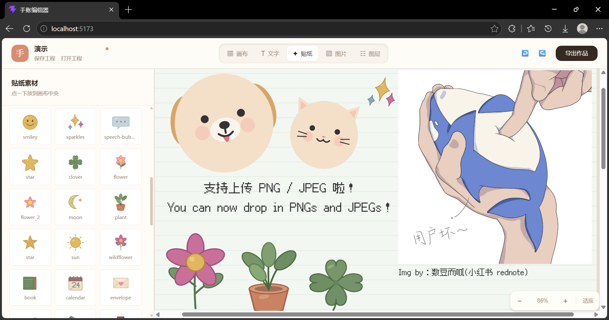

# 手账编辑器

一个运行在本机浏览器里的私人手账排版工具。可以在画布上组合文字、贴纸和照片，保存可继续编辑的工程文件，再导出 PNG 或 SVG。

项目以个人使用为主：不需要注册、登录或云服务，素材和工程文件都由自己保管。



## 现在能做什么

- 在画布上添加、移动、缩放和旋转文字、贴纸与图片
- 使用四角控制点缩放元素，使用顶部控制点旋转元素
- 设置画布尺寸、纸张颜色以及横线、网格、点阵底纹
- 调整字体、字号、粗细、颜色、行高和对齐方式
- 管理图层顺序、显示状态和删除操作
- 撤销、重做最近的编辑操作
- 上传 PNG/JPEG，或使用本地图片素材库
- 使用分类贴纸和本地字体
- 保存 `.shouzhang` 工程文件并在之后重新打开
- 在存在未保存改动时提示关闭或刷新风险
- 导出 PNG 位图或 SVG 矢量图

## 界面操作

### 编辑元素

1. 从顶部选择“文字”“贴纸”或“图片”。
2. 添加元素后，单击元素将其选中。
3. 拖动选中元素可以移动位置。
4. 拖动四角控制点可以改变尺寸。
5. 拖动顶部圆形控制点可以旋转。
6. 在“图层”面板中调整顺序、隐藏或删除元素。

### 浏览画布

- 鼠标位于纸张上时，滚轮用于缩放画布。
- 鼠标位于纸张外时，滚轮用于上下滚动工作区。
- 按住空格并拖动鼠标左键，可以移动画布视口。
- 使用鼠标中键拖动，也可以移动画布视口。
- 右下角提供缩小、放大和适应窗口按钮。

### 保存工程

顶部左侧可以编辑工程名称，并执行“保存工程”或“打开工程”。

工程文件使用 `.shouzhang` 扩展名，本质上是带版本信息的 JSON，保存内容包括：

- 画布尺寸、背景和底纹
- 文字、贴纸与图片元素
- 元素位置、尺寸、旋转、图层和可见状态
- 本地上传图片的数据

本地上传的图片会嵌入工程文件，因此工程文件可以移动到其他位置后继续打开。图片较多时，工程文件也会相应变大。

浏览器关闭确认由浏览器自身控制。存在未保存改动时会显示标准离开提醒，但网页无法自定义这段提示文字，也不能在该系统弹窗中加入“保存”按钮。

## 安装与启动

### 环境要求

- Windows
- Python 3.11 或更高版本
- Node.js 18 或更高版本
- npm

### 安装依赖

在项目根目录执行：

```powershell
python -m pip install -e .
python -m pip install fastapi uvicorn resvg-py
npm install --prefix editor
```

如果 `resvg-py` 无法使用，也可以安装 CairoSVG 作为 PNG 后端：

```powershell
python -m pip install cairosvg
```

### 一键启动

```powershell
python run.py
```

启动成功后浏览器会自动打开：

```text
http://localhost:5173
```

后端 API 运行在：

```text
http://127.0.0.1:8000
```

保持启动窗口开启。按 `Ctrl+C` 会停止前后端服务。

> `run.py` 启动前会处理占用 `5173` 和 `8000` 端口的监听进程。如果这些端口正在运行其他重要程序，请先手动关闭或改用下面的分开启动方式。

### 分开启动

终端一：

```powershell
python -m uvicorn server:app --host 127.0.0.1 --port 8000
```

终端二：

```powershell
npm run dev --prefix editor -- --host 127.0.0.1
```

## 添加自己的素材

素材由后端启动时或接口请求时从本地目录读取。新增素材后刷新页面即可。

### 贴纸

将 SVG 放入：

```text
assets/stickers/<分类名>/
```

示例：

```text
assets/stickers/emotion/happy.svg
assets/stickers/plant/leaf.svg
```

子目录名称会显示为贴纸分类。贴纸建议使用包含 `viewBox` 的纯 SVG，并避免脚本、外部链接或其他不可信内容。

### 图片素材库

将 PNG、JPEG 或 WebP 放入：

```text
assets/images/
```

也可以使用子目录分类：

```text
assets/images/photos/summer.jpg
assets/images/textures/paper.png
```

图片素材与贴纸分开显示。除了素材库，也可以在编辑器的“图片”面板直接上传 PNG/JPEG；单张上传限制为 8MB。

### 字体

将 TTF 或 OTF 放入：

```text
src/font/
```

也可以运行字体下载脚本：

```powershell
python scripts/download_fonts.py
```

详细说明见 [字体系统](docs/fonts.md)。请自行确认字体许可是否允许个人使用、分发或商用。

### 画布预设

将 JSON 预设放入：

```text
assets/presets/
```

预设示例：

```json
{
  "name": "方形手账",
  "width": 1080,
  "height": 1080,
  "background": "#fbfaf6",
  "pattern": "none"
}
```

### 内置模板

Python 渲染引擎的模板位于：

```text
src/shouzhang/templates/builtin/
```

这些模板主要供命令行示例和渲染引擎使用。目前网页编辑器的日常工作流以 `.shouzhang` 工程文件为主。

模板格式见 [模板格式](docs/templates.md)。

## 富文本

文字内容支持以下简单标记：

| 标记 | 效果 |
|---|---|
| `**文字**` | 粗体 |
| `*文字*` | 斜体 |
| `__文字__` | 下划线 |
| `~~文字~~` | 傍点 |
| `[c=#e94560]文字[/c]` | 自定义颜色 |
| `[s=24]文字[/s]` | 自定义字号 |

完整语法见 [富文本语法](docs/richtext.md)。

## 导出

点击右上角“导出作品”，可以选择：

- **PNG**：适合分享、作为图片插入其他软件或打印。
- **SVG**：保留矢量内容，适合继续处理或高质量缩放。

PNG 可以设置输出宽度和超采样倍率。最终像素宽度等于所选宽度乘以倍率，最大限制为 10000 像素。

SVG 中的本地字体依赖当前机器的字体文件路径。将 SVG 移到其他电脑后，若缺少对应字体，显示效果可能变化；需要稳定分享时优先使用 PNG。

## 命令行渲染

不打开网页也可以运行内置模板示例：

```powershell
python examples/demo.py
```

输出目录：

```text
examples/out/
```

渲染管线为：

```text
Template JSON -> Document -> RenderIR -> SVG -> PNG
```

## 项目结构

```text
.
|-- assets/                         # 贴纸、图片、背景、胶带和画布预设
|   |-- images/                     # 图片素材库
|   |-- presets/                    # 画布预设
|   `-- stickers/                   # SVG 贴纸
|-- docs/                           # 模板、字体、富文本和渲染文档
|-- editor/                         # Vue 3 网页编辑器
|-- examples/                       # Python 渲染示例
|-- scripts/                        # 字体下载等辅助脚本
|-- src/shouzhang/                  # Python 模型、排版和渲染引擎
|-- tests/                          # 关键渲染回归测试
|-- web-old/                        # 旧版网页备份，不参与当前程序运行
|-- run.py                          # Windows 一键启动入口
`-- server.py                       # 当前 FastAPI 后端
```

## 关于 `web-old/`

`web-old/` 是旧版网页实现的备份，当前程序不会读取或启动其中的文件。

当前有效入口是：

- 网页前端：`editor/`
- 后端服务：`server.py`
- 一键启动：`run.py`

可以继续保留 `web-old/` 作为历史版本参考，但新功能不会自动同步到那里，也不建议再从它启动服务。

## 常见问题

### 页面只显示白色

先确认前端服务仍在运行，再访问 `http://localhost:5173`，不要访问带有 `view-source:` 前缀的地址。可以按 `Ctrl+F5` 强制刷新。

手动检查：

```powershell
Invoke-WebRequest -UseBasicParsing http://localhost:5173/
Invoke-WebRequest -UseBasicParsing http://127.0.0.1:8000/api/presets
```

### 页面能打开，但字体、贴纸或图片素材为空

通常是后端没有启动。确认 `http://127.0.0.1:8000/api/presets` 可以访问，并检查启动窗口中的错误。

### PNG 导出失败

安装至少一个 PNG 后端：

```powershell
python -m pip install resvg-py
```

或：

```powershell
python -m pip install cairosvg
```

如果文本使用自定义字体，Windows 上也可能通过 Edge/Chrome 无头模式完成渲染。

### 关闭页面时为什么不能直接保存

浏览器不允许网页在关闭过程中静默下载文件。编辑器只能提示存在未保存内容，需要先取消关闭，再点击“保存工程”。

### 工程文件很大

本地上传的 PNG/JPEG 会嵌入 `.shouzhang` 文件。减少图片尺寸或改用 `assets/images/` 中的本地素材，可以减小工程文件。

## 开发与验证

前端生产构建：

```powershell
npm run build --prefix editor
```

Python 测试：

```powershell
python -m pip install pytest
python -m pytest
```

Python 语法检查：

```powershell
python -m compileall -q server.py src tests
```

## 技术栈

| 部分 | 技术 |
|---|---|
| 网页编辑器 | Vue 3、Pinia、Vite、Tailwind CSS |
| 本地服务 | FastAPI、Uvicorn、Pydantic |
| 排版与渲染 | Python、RenderIR、SVG |
| PNG 光栅化 | resvg-py、CairoSVG 或 Edge/Chrome headless |

## 进一步文档

- [模板格式](docs/templates.md)
- [字体系统](docs/fonts.md)
- [富文本语法](docs/richtext.md)
- [渲染架构](docs/rendering.md)
- [Python API](docs/api.md)
- [素材说明](docs/assets.md)

## 许可

项目代码使用 MIT License。字体、图片和贴纸可能有各自的许可要求，使用或分发前请分别确认。
